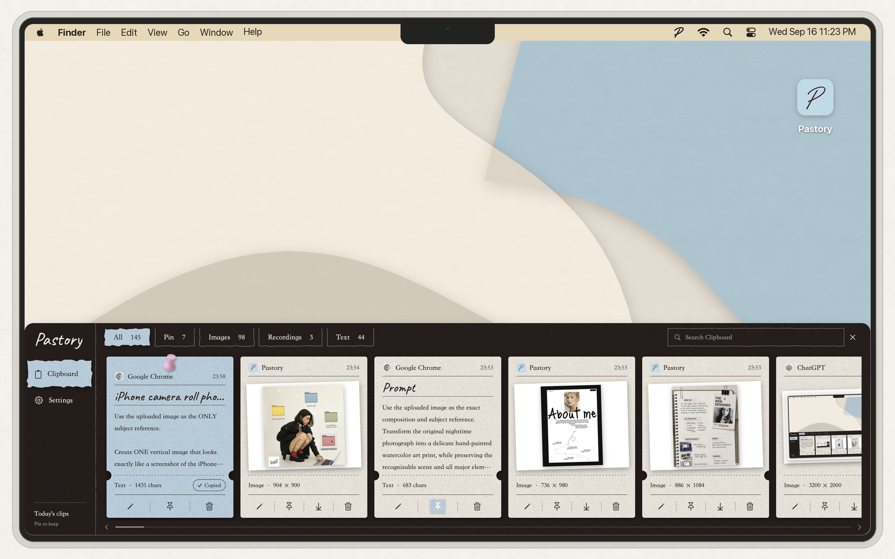
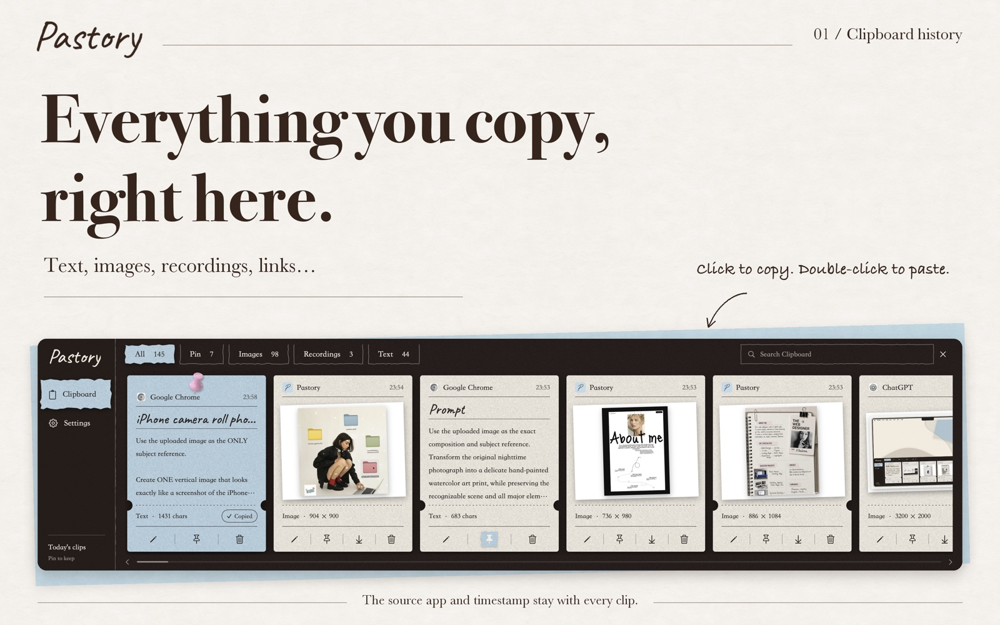
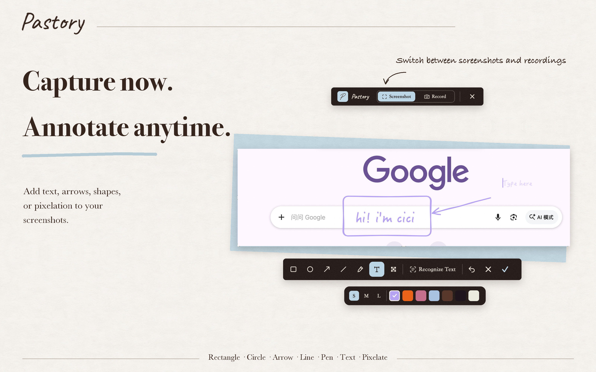
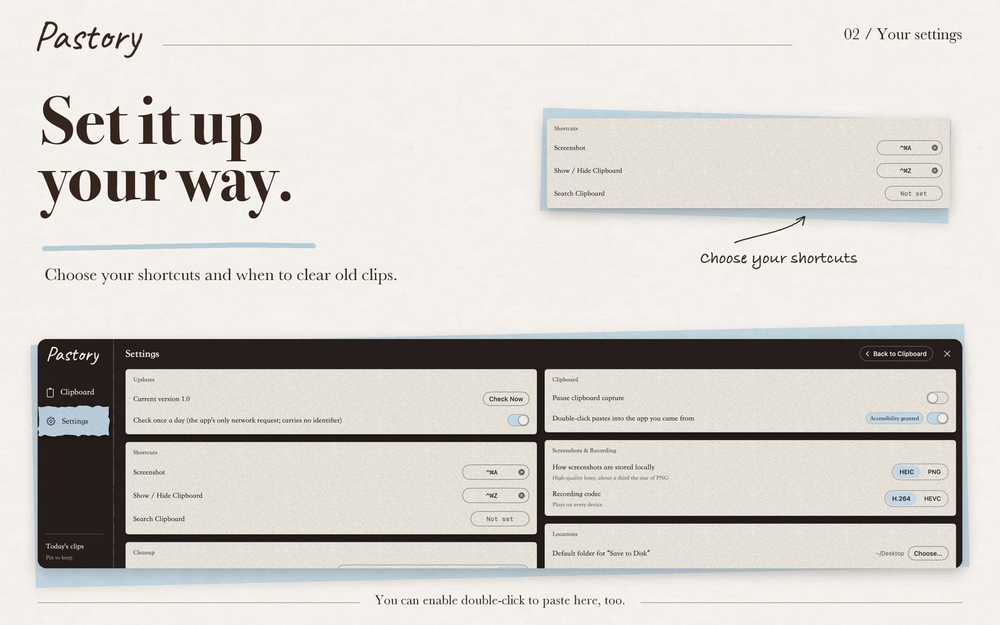
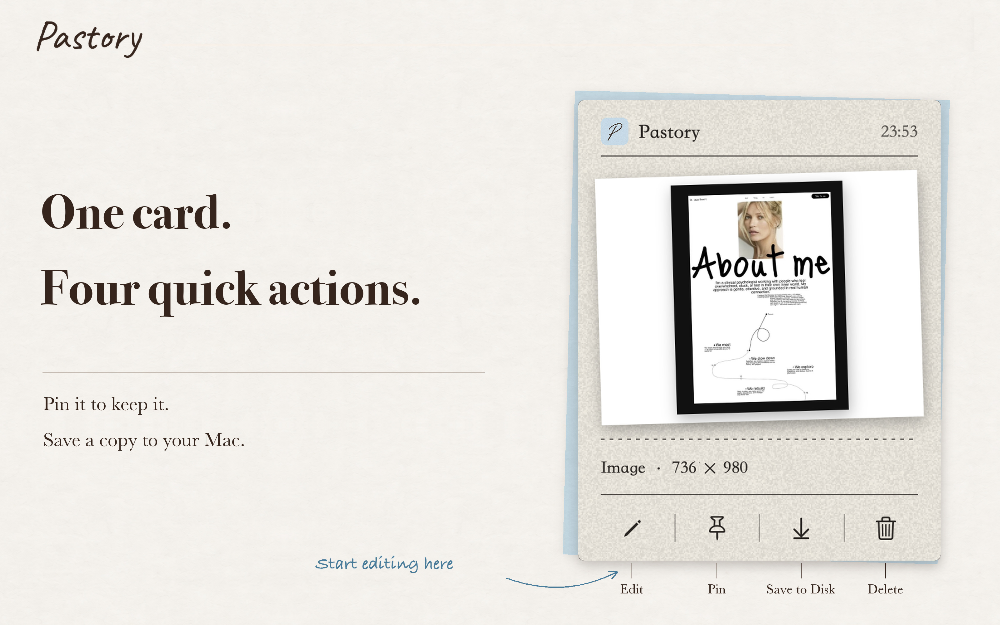
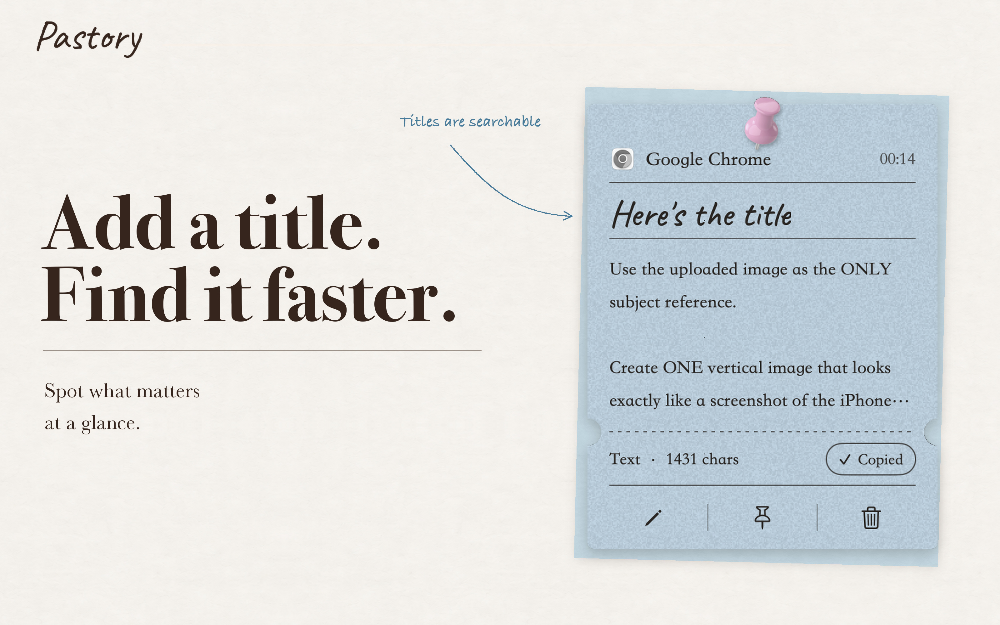
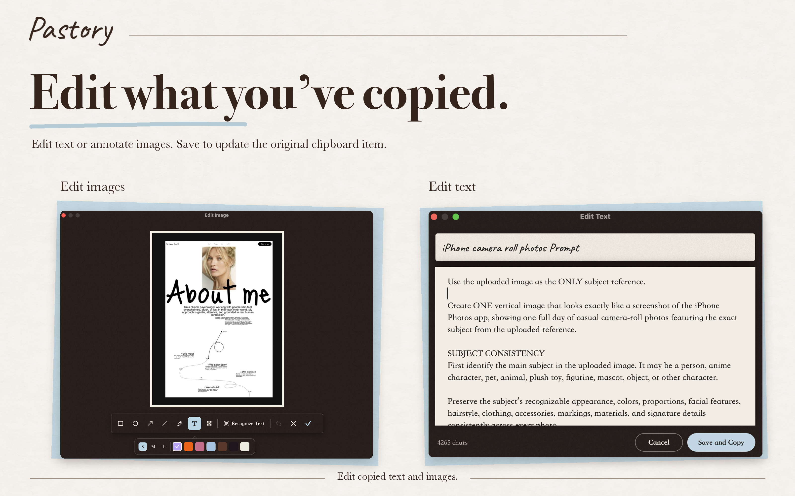
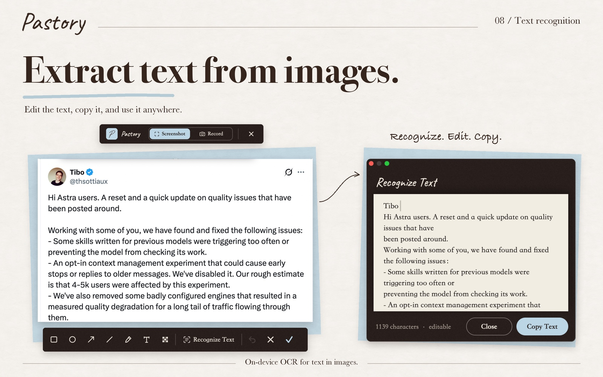
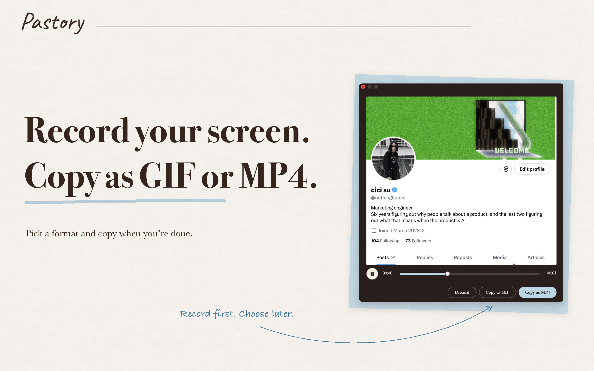

<p align="center">
  
</p>

<h1 align="center">Pastory</h1>

<p align="center">Pastory = Paste + History</p>

<p align="center">
  <a href="README.md">简体中文</a> · English
</p>

<p align="center">Like it? A Star would mean a lot. Thank you!</p>

<br>

<p align="center">
  
</p>

<br>

<p align="center">Everything on your computer keeps a history. Everything except the clipboard, which only remembers the last thing.</p>

<p align="center">You press ⌘C dozens of times a day. More than half of those are things you have copied before.</p>

<p align="center">So the things you use most often — the prompt that works, that link you found, a screenshot, a client's address, your invoice details —<br>disappear the moment you copy the next thing.</p>

<p align="center">Pastory gives the clipboard a long-term memory:<br>text, links, images, screenshots, and recordings you copy all live in one panel where you can manage and reuse them.</p>

<p align="center">
Pin what you use often. Pinned items are never removed, even with automatic cleanup on.<br>
Give important items a title so you can spot them at a glance.<br>
Click to copy. Double-click to paste directly into the app you were using.
</p>

<p align="center">Everything stays on your Mac. No account, and no network access apart from a daily update check. Your data is 100% yours.</p>

<br>

## Install

Requires macOS 15 or later. Runs on Intel and Apple silicon.

1. Download the [latest release](../../releases/latest), unzip it, and drag `Pastory.app` into Applications.
2. Open it. A handwritten **P** appears in the menu bar, and the clipboard panel opens once on first launch. (Notarized by Apple.)

   

3. The first time you take a screenshot, allow **Screen Recording** when prompted, then reopen Pastory.

Shortcuts, cleanup schedule, screenshot storage format, and more can be changed in Settings.

<br>

## Why I built it

### The clipboard — the real need

I copy text and take screenshots many times a day, and a good number of those are things I already did an hour earlier (ADHD). The same actions, over and over.

Things I used often ended up in Notes sometimes, in Obsidian other times. Scattered everywhere.

So I built this little app.

Every copy, screenshots included, is collected in one place, ready to be revisited, reused, or edited.

**Power move:** if the things you copy are information-dense, have an agent read your Pastory database periodically and turn it into a reviewable Markdown knowledge base.



### Screenshots (a small indulgence)

I used two screenshot tools side by side.

WeChat's shifts the colors, but I love its text recognition, so I reached for it whenever I needed the text.

Feishu's keeps the colors right and can also record MP4 / GIF, so I reached for it for those.

Which shortcut to press was something I had to think about every single time.

Both can annotate, but neither looks nice doing it. I care about how the font and the text box look while I annotate (I need my small joys).

So Pastory brings all of that together.



<br>

## Features

### Clipboard history

Open it with a shortcut of your choice or from the menu bar icon. Everything you copy appears as a card, along with the app it came from and the time.

- **Copy:** click any card to copy it, ready to paste into the field you're working in.
- **Copy and paste in one step:** double-click a card and its content is pasted directly into the app you were using.
- **Search:** search your history by keyword, across text, titles, and text recognized inside images.
- **Pin to keep:** pin important items to keep them for good. Unpinned items are cleaned up on a schedule you set.
- **Titles:** name important items so you can find them at a glance.
- **Edit in place:** text and images can be edited. The result replaces the original on the same card, ready for next time.
- **Screenshots from other apps:** WeChat, Feishu, the built-in macOS screenshot — anything that reaches the clipboard gets a card, and can be searched, pinned, and annotated like everything else.

<p>
  
  
</p>
<p>
  
  
  
</p>

### Screenshot & recording

Take screenshots and recordings with the shortcut you set.

Colors are captured in the display's own color space, so nothing shifts.

**Annotations are in the style of Obsidian's Excalidraw plugin** (if you've used it, you'll be happy to see this): rectangle, ellipse, arrow, line, pen, text, and mosaic, with seven low-saturation colors. The pictures you share will look good.

**Text recognition:** powered by Apple's on-device OCR. Recognized text is stored with the image in the clipboard, so you can use it later.

**Recording:** MP4 / GIF. Pick the format after recording.

<p>
  
  
  
</p>

<br>

## Why you might want it

#### Shipping addresses, invoice details, canned replies — the text you use all the time

We've all been there: you need one piece of information and end up digging through chat history to find it, again.

With Pastory: copy it once and give it a title such as "Client A address" or "Company invoice details". Pin it. Next time, double-click and it's pasted.

#### Prompts that work, links worth keeping

The moment you copy it, it's in your clipboard — no more forcing yourself to save everything to a notes app. Next time you do a similar task, you don't have to remember which session you discussed it in or scroll through dozens of turns to find it.

With Pastory: search a keyword and it's there whenever you need it.

#### A visual reference library

When you vibe-code a product, visuals matter. I used to take screenshots of references frantically and save each one to a local folder — at least ten seconds per image.

With Pastory: take a screenshot, and the images line up in the clipboard so you can compare them and pick the final one. Pin the ones you like, open them to annotate when needed, and save to your desktop when you want — always as a full-resolution PNG.

<br>

## Privacy

- All data lives in `~/Library/Application Support/Pastory/`: plain files plus one SQLite index. You can browse it, back it up, or copy it to another Mac and import it.
- No account, no analytics. The only network request is a daily update check; it carries no identifier and can be turned off in Settings.
- Items that password managers mark as concealed are never recorded.

<br>

## Build from source

```bash
git clone https://github.com/nothingbutcici/pastory.git
cd pastory
./build.sh          # → build/Pastory.app
```

Swift Package Manager, Apple frameworks only. Project conventions are in [docs/DEVELOPMENT.md](docs/DEVELOPMENT.md).

<br>

## Credits & license

Typefaces: [Caveat](https://fonts.google.com/specimen/Caveat) and [Ysabeau Office](https://fonts.google.com/specimen/Ysabeau+Office) (SIL Open Font License). Interaction inspired by [Paste](https://pasteapp.io); annotation style after [Excalidraw](https://excalidraw.com).

[MIT License](LICENSE) · © 2026 nothingbutcici
