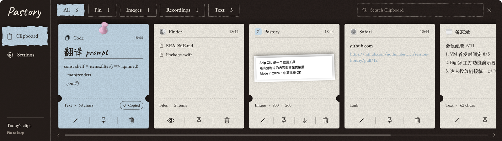
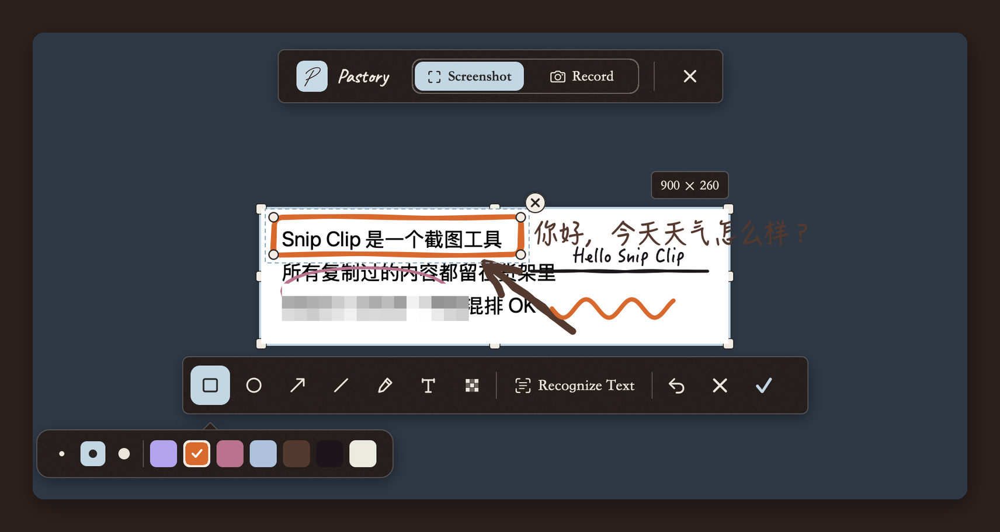
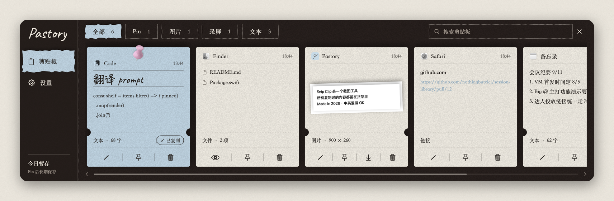
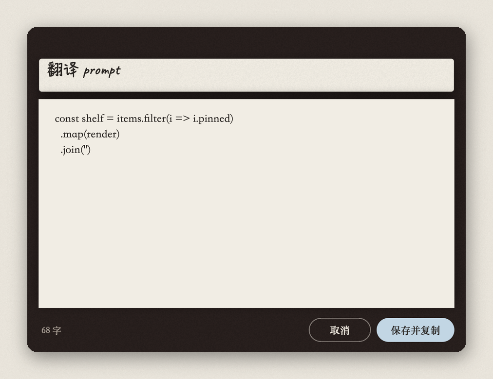
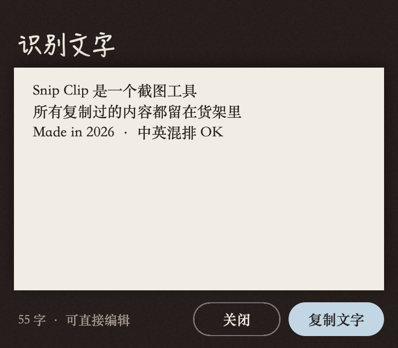
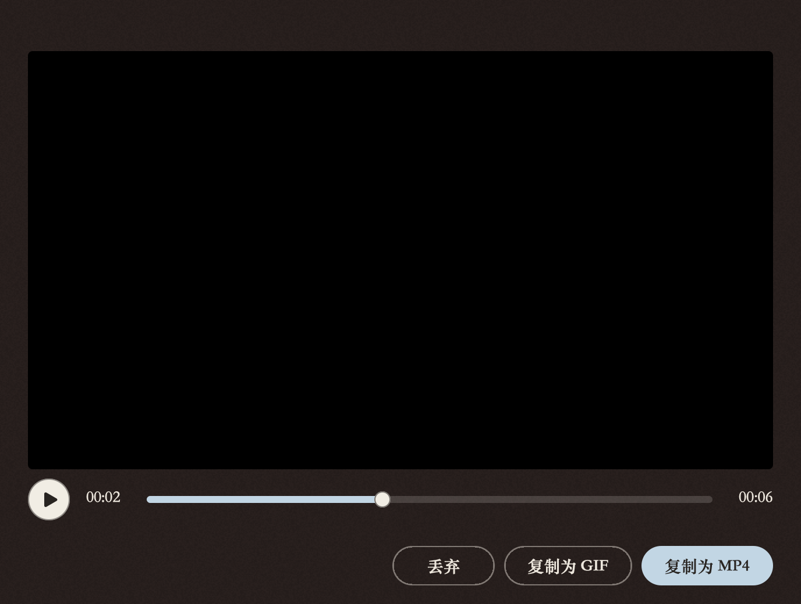
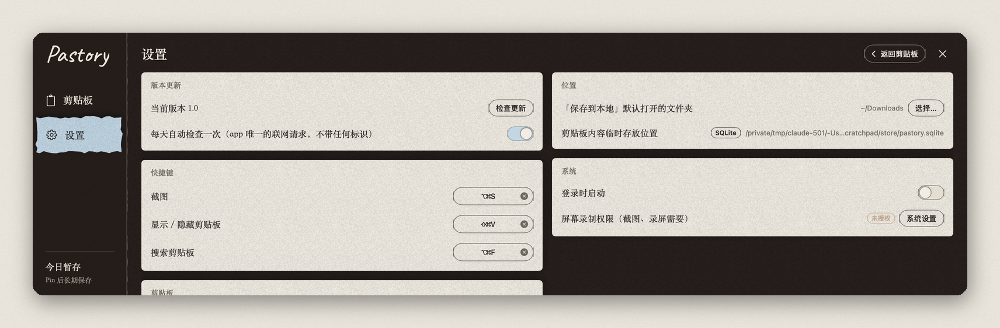

<p align="center">
  
</p>

<h1 align="center">Pastory</h1>

<p align="center">
  <b>Paste + History.</b> A paper shelf at the bottom of your Mac that keeps everything you copy —<br>
  and a screenshot tool whose pictures land on that same shelf.
</p>

<p align="center">
  <a href="README.zh.md">中文</a> ·
  <a href="#install">Install</a> ·
  <a href="#what-its-for">What it's for</a> ·
  <a href="#a-tour">Tour</a> ·
  <a href="#privacy--your-data">Privacy</a> ·
  <a href="#build-from-source">Build</a>
</p>

<p align="center">
  
</p>

<p align="center">
  <sub>macOS 15+ · Apple silicon &amp; Intel · no account · no network · open source</sub>
</p>

---

## Why this exists

I used two screenshot tools at once. One shifted the colors of everything it captured but could read text out of the picture. The other kept the colors right but couldn't. Neither let me look back at what I had captured an hour ago, and neither had any idea what I copied in between.

Meanwhile the clipboard itself was a hole. The customer's shipping address, the reimbursement details, the prompt I keep pasting into an AI, the link a colleague sent this morning — every one of them was copied, pasted, lost, and copied again.

Pastory is the tool I wanted instead: **one shortcut to capture, one shortcut to see everything I've copied, and nothing ever leaves my Mac.**

## What it's for

**"I copy this every week."**
Pin it and give it a handwritten title — *翻译 prompt*, *公司地址*, *报销抬头*. Pinned cards are never cleaned up. Next time, ⇧⌘V, double-click, and it is pasted into whatever you were typing in.

**"Where did that screenshot go?"**
Every screenshot you take with Pastory is a card on the shelf, with the text inside it already recognized. Search for a word you remember seeing; the picture comes back. Screenshots from other tools you copy land there too.

**"Send it now, keep it maybe."**
⌥⌘S, drag, ⏎ — the picture is on your clipboard and you're pasting it into the chat. Decide later whether it deserves saving to disk. Unpinned things quietly expire on a schedule you set.

**"This needs a red box."**
Excalidraw-style annotations: rectangle, ellipse, arrow, line, pen, text, mosaic. Seven quiet colors, three weights, everything draggable and reshapeable, sketchy on purpose.

**"Can you show me?"**
Frame the same region and record it — MP4 for anything longer, GIF for a ten-second bug report. Native Retina pixels, encoded while recording, no waiting at the end.

**"I'm coming from Paste."**
Settings › Import reads Paste's database directly (and other SQLite-based managers heuristically). Your history comes over with its pins; it sorts behind what Pastory records itself.

## A tour

### Capture

<p align="center"></p>

- Drag a region, tap a window (Space), or take the whole screen (F / ⏎). Handles let you resize after the fact; the front app's menus and pop-ups stay open and end up in the picture.
- Color-accurate: captured in the display's own color space. Display P3 stays P3; nothing is squashed to sRGB.
- **Recognize Text** runs Apple's on-device OCR (Chinese and English) and hands you an editable result.
- Switch to **Record** on the same frame. The clip previews before anything is copied.

### The shelf

<p align="center"></p>

- Cards for text, links, images, files and recordings, with the app they came from and the time.
- **Click** copies and keeps the shelf open (the blue card with the pushpin is what's on your clipboard right now). **Double-click** copies, closes, and pastes into the app you came from; **⏎** copies and closes. **Space** is Quick Look.
- Just start typing to search — across text, titles and the words recognized inside images. ↑↓ moves, ⏎ takes.
- Pin, rename, edit text in place, re-annotate an image, save to disk.
- Copying something you copied before brings the old card back instead of making a twin.

### Editing what you already copied

<p align="center"> </p>

Text opens in a plain editor that writes back to the same card. Images open in the annotator. Recognized text can be edited before it is copied.

### Recording

<p align="center"></p>

The recording plays back before you decide: **Copy as MP4** (H.264, or HEVC in settings) or **Copy as GIF** (size-capped by length so it still sends). A typical UI walkthrough weighs about 9 MB per minute.

### Retention you can explain to someone

Unpinned items live for *N* calendar days — 1, 3, 7, 30, 365 or forever — and are cleaned up at a time of day you pick (04:00 by default). Pinned items are never deleted automatically. Deleting by hand is final, and it stays final: an import cannot bring a deleted item back.

<p align="center"></p>

## Keyboard

| | |
|---|---|
| ⌥⌘S | Screenshot / record (drag; Space = window; F or ⏎ = whole screen; ⎋ = cancel) |
| ⇧⌘V | Open the shelf · ⌥⌘F opens it with search focused |
| ← → ↑ ↓ | Move between cards · type anything to search |
| ⏎ | Copy and close · double-click also pastes into the app you came from |
| Space | Quick Look · P pin · S save to disk · ⌫ delete |
| In the annotator | R O A L P T M pick tools · ⌘Z undo · ⏎ done · ⎋ cancel |

All three global shortcuts can be changed in Settings; Pastory refuses a combination another app already owns and tells you which.

## Install

Requires macOS 15 (Sequoia) or later, Intel or Apple silicon.

1. Download `Pastory-<version>.zip` from [Releases](../../releases), unzip, drag `Pastory.app` into Applications.
2. Open it. Releases are signed and notarized by Apple; at most macOS asks once whether to open an app downloaded from the internet.
3. Pastory has no main window: look for the handwritten **P** in the menu bar. The shelf opens by itself the first time.
4. The first screenshot asks for **Screen Recording** permission; turn Pastory on and relaunch it.
5. Optional: **Accessibility** lets double-click paste into the app you came from. Without it, double-click copies and closes.

Updates: Pastory asks GitHub once a day whether a newer release exists and offers to install it (Settings › Updates; off if you prefer).

## Privacy & your data

- Everything is in `~/Library/Application Support/Pastory/`: a small SQLite index (`pastory.sqlite`) next to plain files — `items/<id>.txt`, `.heic`, `.png`, `.mp4`, `.gif` and a `thumbs/` folder. Open it in Finder, back it up, copy it to another Mac and import it.
- Screenshots are kept as high-quality HEIC by default (about a third of PNG; lossless PNG is a setting). The copy you paste right after capturing is lossless, and **Save to Disk** always writes a full-resolution PNG.
- Pastory reads the general pasteboard's change counter twice a second and reads content only when it changed. Items marked concealed or transient by password managers are skipped.
- The only network request is the daily update check. It carries no identifier and can be turned off.
- No account, no analytics, no telemetry.

## Build from source

```
git clone https://github.com/nothingbutcici/pastory.git
cd pastory
./build.sh          # → build/Pastory.app (this machine's architecture)
./dist.sh           # → dist/Pastory-<version>.zip (universal binary + first-open notes)
```

Swift Package Manager, macOS 15 SDK, Apple frameworks only (ScreenCaptureKit, Vision, AVFoundation, SQLite). `build.sh` signs with a local self-signed certificate when one exists (`tools/make-signing-cert.sh` creates it) so the Screen Recording permission survives rebuilds.

Offscreen self-tests render every surface and exercise retention, clipboard ingestion, import, HEIC storage and the recorder's writer — without touching your real data. The project's rulebook (storage and retention rules, visual system, conventions) is [docs/DEVELOPMENT.md](docs/DEVELOPMENT.md).

## Acknowledgements

Typefaces: [Caveat](https://fonts.google.com/specimen/Caveat) and [Ysabeau Office](https://fonts.google.com/specimen/Ysabeau+Office) (SIL Open Font License, bundled in `Resources/Fonts`), Songti SC and HanziPen SC from macOS. The shelf's interaction owes a debt to [Paste](https://pasteapp.io); the annotation style to [Excalidraw](https://excalidraw.com).
