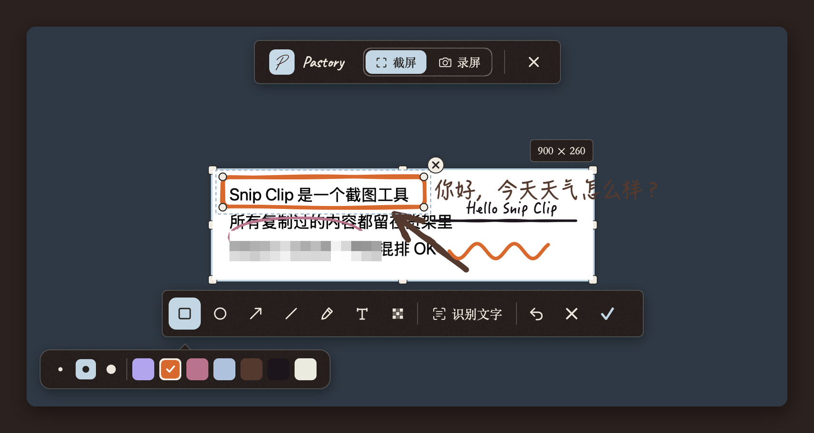

<p align="center">
  
</p>

<h1 align="center">Pastory</h1>

<p align="center">
  <b>Paste + History。</b>Mac 底部的一张纸架，留着你复制过的一切；<br>
  再加一个截图工具，截下来的图也放在同一张架子上。
</p>

<p align="center">
  <a href="README.md">English</a> ·
  <a href="#安装">安装</a> ·
  <a href="#它解决什么">它解决什么</a> ·
  <a href="#走一遍">走一遍</a> ·
  <a href="#隐私与数据">隐私</a> ·
  <a href="#从源码构建">构建</a>
</p>

<p align="center">
  
</p>

<p align="center">
  <sub>macOS 15+ · Apple 芯片与 Intel · 无账号 · 不联网 · 开源</sub>
</p>

---

## 为什么做它

我曾经同时开着两个截图工具。一个截什么都偏色，但能把图里的字识别出来；另一个颜色是对的，但不认字。两个都不能让我回头看一小时前截过的图，也都不知道我中间复制过什么。

而剪贴板本身是个黑洞。客户的收件地址、报销抬头、反复丢给 AI 的那段 prompt、同事早上发来的链接，每一样都是复制、粘贴、丢掉、再复制一遍。

Pastory 是我想要的那个替代品：**一个快捷键截图，一个快捷键看见复制过的一切，而且什么都不会离开我的电脑。**

## 它解决什么

**「这个我每周都要复制。」**
Pin 住，写个手写体的标题：*翻译 prompt*、*公司地址*、*报销抬头*。Pin 住的卡永远不会被清理。下次 ⇧⌘V，双击，它就粘进你正在打字的地方。

**「那张截图去哪了？」**
用 Pastory 截的每一张图都是货架上的一张卡，图里的字已经识别好了。搜一个你记得看见过的词，图就回来。用其他工具截的、复制到剪贴板的图，同样会进来。

**「先发出去，要不要留再说。」**
⌥⌘S，框选，⏎，图已经在剪贴板里，转身就贴进聊天窗口。值不值得存到本地以后再决定；没 Pin 的东西按你定的规则悄悄过期。

**「这里得画个红框。」**
Excalidraw 风格的标注：矩形、椭圆、箭头、直线、画笔、文字、马赛克。七种安静的颜色，三档粗细，全都能拖能改，手绘感是故意的。

**「你演示一下？」**
同一个框，改成录屏：长的录 MP4，十秒的 bug 复现录 GIF。Retina 原生像素，边录边编码，停止就好，不用等。

**「我以前用 Paste。」**
设置 › 导入 直接读 Paste 的数据库（其他基于 SQLite 的剪贴板工具按启发式读），历史连同 Pin 一起过来，排在 Pastory 自己记录的后面。

## 走一遍

### 截图

<p align="center"></p>

- 拖一块区域、点一个窗口（空格）、或整屏（F / ⏎）。选完还能拖手柄改大小；前台应用的菜单和弹层不会因为截图而收起，会一起进到图里。
- 不偏色：按显示器自己的色彩空间取图，P3 屏就是 P3，不转 sRGB。
- **识别文字**用 Apple 本地 OCR（中英文），结果可以先改再复制。
- 同一个框切到**录屏**，录完先预览再决定复制。

### 货架

<p align="center"></p>

- 文本、链接、图片、文件、录屏各有自己的卡片，带来源应用和时间。
- **单击**复制并停留（带粉色钉子的浅蓝卡就是此刻剪贴板里的那条）；**双击**复制、收起、并粘进你刚才所在的应用；**⏎** 复制并收起；**空格**是 Quick Look。
- 直接敲字就是搜索，覆盖正文、标题和图片里识别出的字；↑↓ 移动，⏎ 拿走。
- Pin、起名、原地改文字、给图片再加标注、保存到本地。
- 再次复制以前复制过的内容，不会出现两张一样的卡，原来那张会提到最前。

### 改已经复制过的东西

<p align="center"> </p>

文本在一个干净的编辑器里改，写回同一张卡；图片直接进标注器；识别出的文字可以先改再复制。

### 录屏

<p align="center"></p>

录完先播放，再决定：**复制为 MP4**（H.264，设置里可选 HEVC）或**复制为 GIF**（按时长限制体积，保证发得出去）。一段普通的界面演示大约每分钟 9 MB。

### 说得清的清理规则

没 Pin 的内容保留 *N* 个自然日：1、3、7、30、365 天或永不，在你指定的时刻清理（默认 04:00）。Pin 住的永远不会被自动删除。手动删除是最终的，而且一直最终：导入也不会把删过的东西带回来。

<p align="center"></p>

## 键盘

| | |
|---|---|
| ⌥⌘S | 截图 / 录屏（拖选；空格 = 窗口；F 或 ⏎ = 整屏；⎋ = 取消） |
| ⇧⌘V | 打开货架 · ⌥⌘F 打开并聚焦搜索 |
| ← → ↑ ↓ | 在卡片间移动 · 直接敲字即搜索 |
| ⏎ | 复制并收起 · 双击还会粘进刚才的应用 |
| 空格 | Quick Look · P Pin · S 保存到本地 · ⌫ 删除 |
| 标注器里 | R O A L P T M 选工具 · ⌘Z 撤销 · ⏎ 完成 · ⎋ 取消 |

三个全局快捷键都可以在设置里改；被其他应用占用的组合会被拒绝并告诉你是谁。

## 安装

需要 macOS 15 (Sequoia) 或更新，Intel 和 Apple 芯片都可以。

1. 在 [Releases](../../releases) 下载 `Pastory-<版本>.zip`，解压，把 `Pastory.app` 拖进「应用程序」。
2. 打开它。发布的包都经过 Apple 签名与公证，系统最多问一句「这是从互联网下载的应用，确定打开？」。
3. Pastory 没有主窗口，看菜单栏右上角的手写 **P**。第一次启动会自动弹出货架。
4. 第一次截图会请求**屏幕录制**权限，打开后重新启动 Pastory。
5. 可选：**辅助功能**权限让双击能直接粘进刚才的应用；不给的话双击就是复制并收起。

更新：Pastory 每天问一次 GitHub 有没有新版本，有就提示安装（设置 › 版本更新，可关）。

## 隐私与数据

- 所有内容都在 `~/Library/Application Support/Pastory/`：一个很小的 SQLite 索引（`pastory.sqlite`）加普通文件——`items/<id>.txt`、`.heic`、`.png`、`.mp4`、`.gif`，以及缩略图目录 `thumbs/`。Finder 里能直接看，能备份，拷到另一台 Mac 就能导入。
- 截图默认以高质量 HEIC 保存（约 PNG 的三分之一，可在设置改为无损 PNG）。截完立刻粘贴的那份是无损的，**保存到本地**永远导出全分辨率 PNG。
- Pastory 每半秒读一次系统剪贴板的变化计数，只在变化时读内容；密码管理器标记为隐藏或临时的内容会被跳过。
- 唯一的联网请求是每天一次的更新检查，不带任何标识，可以关掉。
- 没有账号，没有统计，没有上报。

## 从源码构建

```
git clone https://github.com/nothingbutcici/pastory.git
cd pastory
./build.sh          # → build/Pastory.app（本机架构）
./dist.sh           # → dist/Pastory-<版本>.zip（通用二进制 + 首次打开说明）
```

Swift Package Manager，macOS 15 SDK，只用 Apple 自带框架（ScreenCaptureKit、Vision、AVFoundation、SQLite）。有本地自签名证书时 `build.sh` 会用它签名（`tools/make-signing-cert.sh` 生成），这样重新编译不会丢屏幕录制权限。

离屏自测会渲染每个界面，并跑保留期、剪贴板入库、导入、HEIC 存储和录屏写入器的用例，且不会碰你的真实数据。项目的规则本（存储与清理规则、视觉系统、约定）在 [docs/DEVELOPMENT.md](docs/DEVELOPMENT.md)。

## 致谢

字体：[Caveat](https://fonts.google.com/specimen/Caveat)、[Ysabeau Office](https://fonts.google.com/specimen/Ysabeau+Office)（SIL 开源字体许可，随包附带于 `Resources/Fonts`），以及 macOS 自带的宋体-简和翩翩体-简。货架的交互受 [Paste](https://pasteapp.io) 启发，标注风格来自 [Excalidraw](https://excalidraw.com)。
